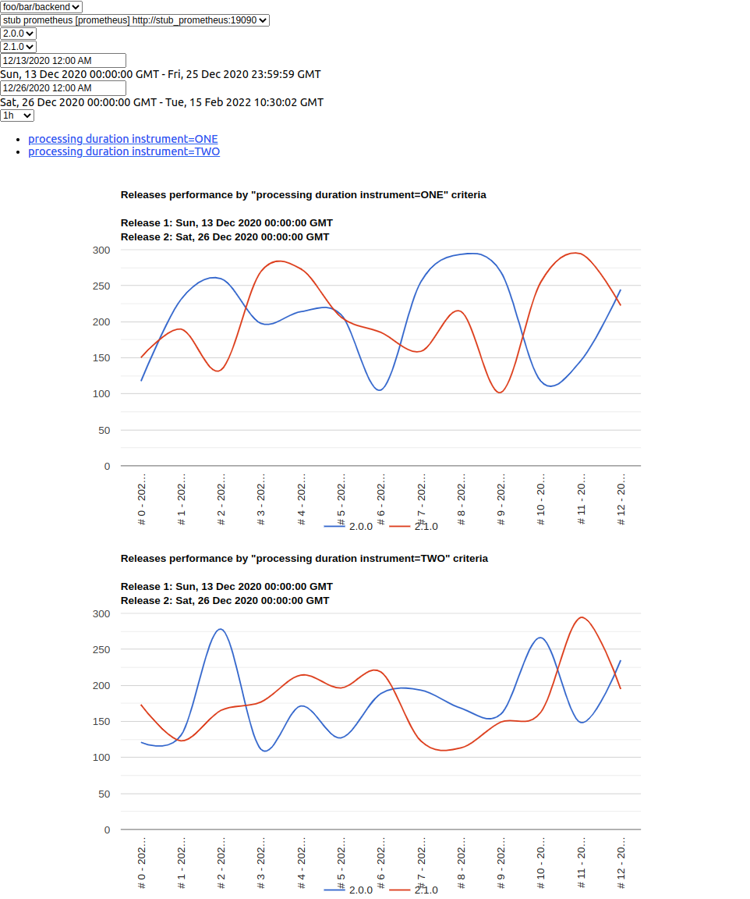

# onix

Releases comparison tool. Use same metrics for 2 different releases and visualize it.

Allow to establish the fact of components regression.

### Stack

* Go 1.16
* Postgres 10
* React

### Components

* **api dashboard-admin** - CRUD for services, release, sources and criteria
* **api dashboard-main** - handle request from compare releases frontend side
* **api system** - http handlers for CI integration
* **daemon metrics-extractor** - periodic run extracting data from prometheus API
* **stub prometheus** - fake prom API for demo build
* **util load-historical-metrics** - tool for loading missing metrics

### Definitions

* **Service** - single process or group of processes (in the same namespace in k8s, etc).
* **Source** - time series database (Prometheus/Thanos or InfluxDB).
* **Release** - info about new deployment of some service.
* **Criteria** - prometheus/influx query to extract pairs \<timestamp, double-point-value>
* **Measurement** - locally cached metric, object with source_id, criteria_id, timestamp and value.

### Demo

Run demo with commands:

```shell
docker-compose build
docker-compose up -d
sleep 30 # wait for frontend-prod-builder finished work
echo "Open main dashboard http://localhost:3001/"
echo "Open admin dashboard http://localhost:3002/"

```

<kbd>
    
</kbd>

And remove demo containers with commands:

```shell
docker-compose -f docker-compose.demo.yml down --volumes --remove-orphans
```