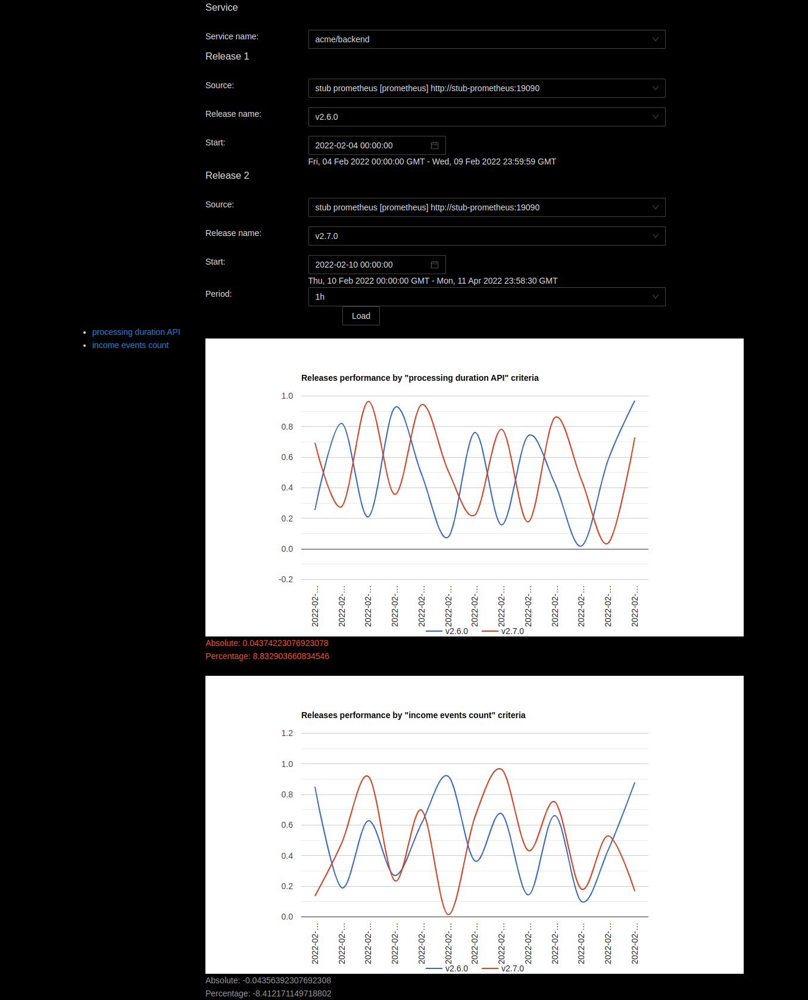

# onix

Releases comparison tool. Use same metrics for 2 different releases and visualize it.

Allow to establish the fact of components regression.

### Stack

* Go 1.16
* Postgres 10
* React

### Components

* **api dashboard-admin** - CRUD for services, release, sources and criteria
* **api dashboard-main** - handle request from compare releases frontend side
* **api system** - http handlers for CI integration
* **daemon metrics-extractor** - periodic run extracting data from prometheus API
* **stub prometheus** - fake prom API for demo build
* **util load-historical-metrics** - tool for loading missing metrics

### Definitions

* **Service** - single process or group of processes (in the same namespace in k8s, etc).
* **Source** - time series database (Prometheus/Thanos or InfluxDB).
* **Release** - info about new deployment of some service.
* **Criteria** - prometheus/influx query to extract pairs \<timestamp, double-point-value>
* **Measurement** - locally cached metric, object with source_id, criteria_id, timestamp and value.

### Demo

Run demo with commands:

```shell
docker-compose down --volumes --remove-orphans
docker-compose build
docker-compose up -d
sleep 30 # wait for frontend-prod-builder finished work
echo "Open main dashboard http://localhost:3001/"
echo "Open admin dashboard http://localhost:3002/"

```

<kbd>
    
</kbd>


And remove demo containers with commands:

```shell
docker-compose down --volumes --remove-orphans
```

### How to use

At first, deploy components to server.

Next step - integration to CI. Add command to deploy job (GitLab CI sample) or to your performance stand runner.

```shell
curl -X GET "http//onix.your-company-name.com:8081/api/system/register?service_name=${CI_PROJECT_NAMESPACE}/${CI_PROJECT_NAME}&release_name=${CI_COMMIT_REF_NAME}-${CI_COMMIT_REF_SLUG}"
```

Go to **admin dashboard** and add criteria items for this service.

What about field *Selector* - write here PromQL query, that returns single vector of values.
If you are not sure, open http://prometheus.your-company-name.com/graph (where prometheus hosted) and debug your query.

Every 15 minutes **daemon metrics-extractor** update data. To update data faster, you can reload daemon.

And then you can open **main dashboard**, select *service*, *source*, *release #1*, *release #2*, *period* and see comparison graphs.

if you need load previous releases, run this command manually to set previous releases start time:

```shell
curl -X GET "http//onix.your-company-name.com:8081/api/system/register?service_name=MY-TEAM/SERVICE-NAME&release_name=TAG-latest&start_at=UNIX_TIME_SECONDS"
```

After you can use **util load-historical-metrics** to load old metrics

```shell
export DB_HOST=localhost
export DB_PORT=5432
export DB_USER=onix
export DB_PASS=onix
export DB_DBNAME=onix

./onix util load-historical-metrics --service foo/backend --source 2 --from 2022-02-01 --till 2022-02-14
```
